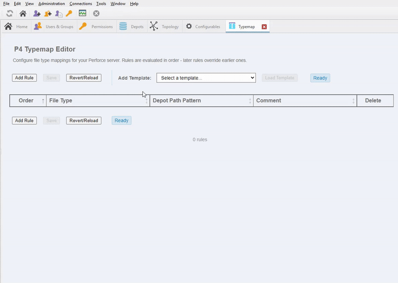
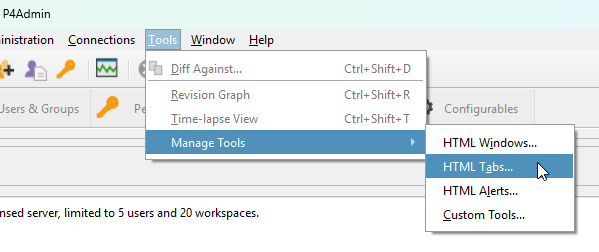
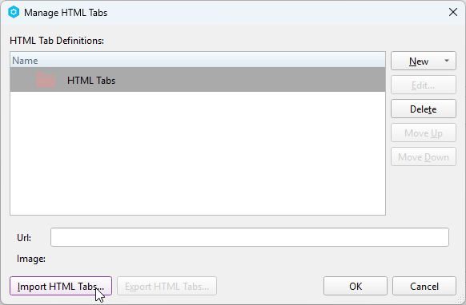
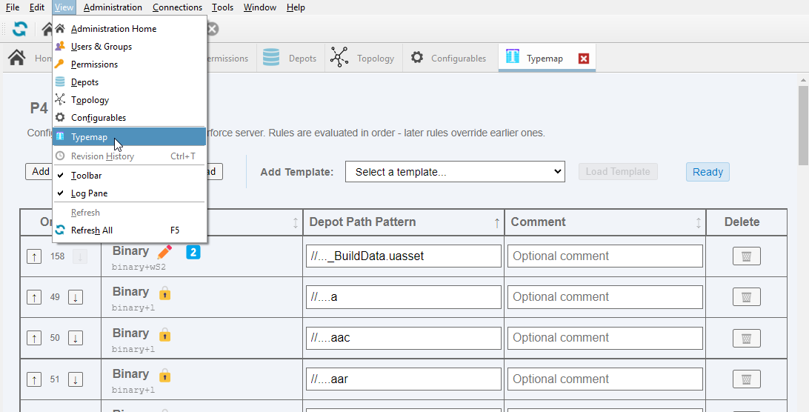
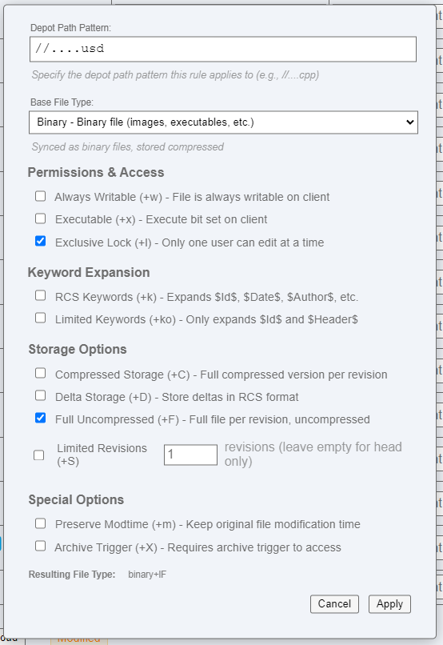

# P4V Tool Tabs

A collection of custom Tabs for P4V and P4Admin to improve quality of life and ease of setup.

## Tools

- [P4 Typemap Editor](#p4-typemap-tool)

## P4 Typemap Tool

A modern, user-friendly GUI tool for managing Perforce typemap configurations within P4V and P4Admin.

If you don't understand what a typemap is, check out [File Types and how to Use the Perforce P4 Typemap](https://www.youtube.com/watch?v=rf5nV3_2Il0&list=PLH3pq2J85xsMDY2AAkzUhTmHIg1S7WN1f&index=6) on YouTube or read up on it in the [P4 Admin Documentation](https://help.perforce.com/helix-core/server-apps/p4admin/current/Content/P4Admin/Home-p4admin.html)

The purpose of this tool is to make it much easier to work with your typemap right inside of P4Admin and apply templates to get you started.

### Installation

1. Download the `typemaptab.xml` from the [Releases page](https://github.com/jase-perf/p4v_tool_tabs/releases/) (or directly from this repo)
2. In P4 Admin, go to Tools > Manage Tools > HTML Tabs...

3. In the Manage HTML Tabs window, select Import HTML Tabs...

4. Select the `typemaptab.xml` file that you download earlier and click Import.
5. Hit OK and now you can access the new tab via the View menu!

### Usage

The table will automatically populate with your existing server typemap.
From there you can `Add Rule` by clicking the button at the top or bottom, which will pop up a form where you can enter a path and select the file type and modifiers.

NOTE: Entries in a typemap are most often for specific file extensions. The pattern for that is `//....extension` with two leading slashes '//', four dots `.`, and then the extension you want the type to apply to.

In order to save any changes you make, click the Save button. Or you can click the Reload/Revert button to undo any changes you've made and restore the typemap as it is on the server.

If typemap rows conflict, the later one (with the higher order number) takes precedence. The order can be adjusted with the up and down arrows if necessary.

Rows can be sorted by any of the columns by clicking on them. They can also be resized.

### Templates

For convenience when setting up a new server or optimizing an existing one, some templates are included, which can be easily applied to your server.

